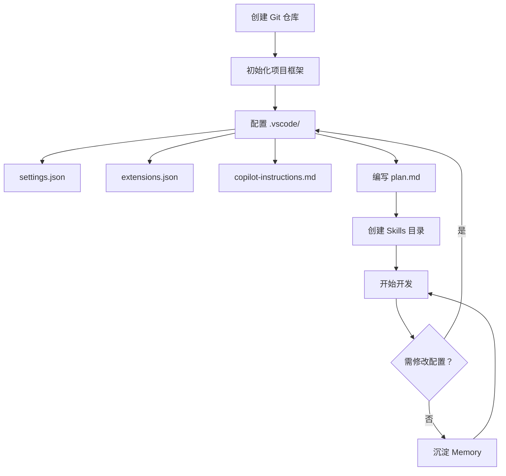

# VS Code Copilot 工作区开发模式最佳实践

> 本文档整理了使用 VS Code Copilot 进行项目开发的工作流、配置管理及效率技巧。

---

## 一、Copilot 核心能力概览

| 能力 | 说明 | 触发方式 |
|------|------|----------|
| **代码补全** | 根据上下文实时建议代码行或代码块 | 输入时自动触发 |
| **内联对话** | 在编辑器中直接向 Copilot 提问或下达指令 | `Cmd + I` |
| **聊天面板** | 打开侧边聊天窗口进行多轮对话 | `Cmd + Shift + I` 或点击聊天图标 |
| **智能重命名** | 语义感知的符号重命名 | 右键 → 重命名符号 |
| **代码解释** | 解释选中代码的功能 | 在聊天中选中代码后问"解释这段代码" |
| **代码修复** | 自动定位并修复错误 | 聊天中输入"修复这个错误" |
| **内联编辑** | 直接在代码上应用修改建议 | `Cmd + I` 输入修改指令 |
| **Agent 模式** | 自主规划并执行多步骤开发任务 | 聊天面板右下角切换 `Agent` |

---

## 二、Agent 模式

### 2.1 什么是 Agent

Agent 是 Copilot 的高级工作模式，能够：

- **自主规划**：将复杂需求拆解为多个可执行的步骤
- **多文件操作**：同时读取、编辑工作区中的多个文件
- **终端执行**：自动运行 shell 命令（安装依赖、启动服务等）
- **错误自愈**：在编辑后检测错误并自动修复

### 2.2 何时使用 Agent

| 场景 | 推荐模式 | 说明 |
|:----:|:--------:|------|
| 简单问询、代码解释 | **聊天** | 一问一答，无需 Agent |
| 单个文件修改 | **内联编辑** | `Cmd + I` 快速修改 |
| 多文件、跨步骤任务 | **Agent** | 创建组件、重构、实现功能 |
| 探索代码库 | **Explore Agent** | 只读搜索，不会修改代码 |

### 2.3 高效使用 Agent 的技巧

```
✅ 好的提示词：
"在 src/components 下创建一个 Button 组件，支持 primary/secondary 两种样式，
  并在 App.tsx 中使用它"

❌ 不好的提示词：
"帮我写个按钮"
```

- **明确文件路径**：指定文件位置避免 Agent 猜测
- **分步描述**：复杂功能拆成多个子任务
- **提供上下文**：说明项目使用的框架、库、代码风格

### 2.4 内置 Agent 列表

| Agent 名称 | 用途 | 说明 |
|------------|------|------|
| **默认 Agent** | 通用开发 | 编码、修改、调试等日常任务 |
| **Explore** | 代码探索 | 只读模式，适合搜索和理解代码库 |

---

## 三、指令集（Instructions）

### 3.1 什么是指令集

指令集（`.instructions.md` / `.prompt.md`）是项目级别的 Copilot 行为配置文件，用于**定义开发规范、编码风格和约束条件**。

### 3.2 文件生效层级

| 层级 | 文件路径 | 作用范围 |
|:----:|----------|----------|
| **全局** | `~/.vscode/copilot-instructions.md` | 所有项目 |
| **用户** | `~/.vscode/copilot-custom-commands.json` | 自定义命令 |
| **工作区** | `.vscode/instructions.md` | 当前工作区 |
| **项目** | `.github/copilot-instructions.md` | 当前仓库 |

### 3.3 指令集最佳实践

```markdown
<!-- .github/copilot-instructions.md 示例 -->

# Copilot 指令

## 项目概述
- 项目名称：ToonCam
- 技术栈：React Native + Expo + TypeScript
- 目标平台：iOS / Android

## 编码规范
- 使用 TypeScript 严格模式
- 组件使用函数式组件 + Hooks
- 样式使用 StyleSheet.create()
- 注释使用 JSDoc 格式

## 命名约定
- 组件文件：PascalCase（如 `Button.tsx`）
- 工具函数：camelCase（如 `formatDate.ts`）
- 常量：UPPER_SNAKE_CASE

## 测试要求
- 每个组件至少有一个单元测试
- 测试文件与源文件同目录，命名为 `*.test.tsx`
```

### 3.4 指令集的作用

| 作用 | 说明 |
|------|------|
| **约束代码风格** | 确保生成代码符合项目规范 |
| **减少重复说明** | 不需要每次对话都重申项目上下文 |
| **团队一致** | 多人协作时保持代码风格统一 |
| **提升准确率** | 提供更多上下文让 Copilot 生成更准确的代码 |

---

## 四、技能集（Skills）

### 4.1 什么是 Skills

Skills 是**可复用的领域知识包**，封装了特定领域的开发知识和最佳实践。例如：React 开发指南、项目管理流程、图像处理算法等。

### 4.2 Skills 的构成

每个 Skill 通常包含：

```
skills/
├── react-setup/          # Skill 名称
│   ├── SKILL.md          # 核心文档（描述、用法、示例）
│   └── templates/        # 模板文件（可选）
│       └── component.tsx
├── image-processing/
│   ├── SKILL.md
│   └── ...
└── project-planning/
    └── SKILL.md
```

### 4.3 何时创建自己的 Skill

| 场景 | 说明 |
|------|------|
| **重复性任务** | 频繁做同一类操作（如创建组件模板） |
| **领域知识** | 项目特有的技术栈、架构约定 |
| **团队规范** | 代码审查标准、Git 提交规范 |
| **学习记录** | 踩坑经验、调试技巧的沉淀 |

### 4.4 最佳实践

```markdown
<!-- SKILL.md 示例结构 -->

# Skill 名称

## 描述
简要说明此 Skill 解决什么问题。

## 使用场景
- 场景 A：...
- 场景 B：...

## 步骤
1. 第一步做什么
2. 第二步做什么
...

## 示例
```typescript
// 示例代码
```

## 注意事项
- 常见陷阱
- 性能考虑
```

---

## 五、Codespace 管理

### 5.1 什么是 Codespace

Codespace 是基于云的开发环境，让你在浏览器或 VS Code 中直接开发，无需本地配置环境。

### 5.2 创建与配置

| 步骤 | 操作 | 说明 |
|:----:|------|------|
| 1 | 打开 GitHub 仓库 | 确保仓库已推送到 GitHub |
| 2 | 点击 `Code` → `Create codespace` | 选择分支和机器类型 |
| 3 | 等待环境初始化 | 自动加载 devcontainer 配置 |
| 4 | 开始开发 | 浏览器或本地 VS Code 均可连接 |

### 5.3 `devcontainer.json` 配置

```json
{
  "name": "ToonCam Dev",
  "image": "mcr.microsoft.com/devcontainers/typescript-node:18",
  "features": {
    "ghcr.io/devcontainers/features/node:1": {
      "version": "18"
    }
  },
  "postCreateCommand": "npm install",
  "customizations": {
    "vscode": {
      "extensions": [
        "github.copilot",
        "github.copilot-chat",
        "dbaeumer.vscode-eslint"
      ],
      "settings": {
        "editor.formatOnSave": true
      }
    }
  }
}
```

### 5.4 最佳实践

| 实践 | 说明 |
|------|------|
| **使用 devcontainer** | 统一开发环境，避免"在我机器上能跑"的问题 |
| **最小化镜像** | 只安装必要的工具，减少启动时间 |
| **配置持久化** | 使用 `postCreateCommand` 自动安装依赖 |
| **定期停止** | 不用时停止 Codespace，节省配额 |

---

## 六、工作区（Workspace）管理

### 6.1 工作区的概念

VS Code 工作区是**项目文件、配置和扩展的集合**，分为两种：

| 类型 | 文件 | 说明 |
|------|------|------|
| **单文件夹** | 无 `.code-workspace` | 打开一个文件夹 |
| **多根工作区** | `*.code-workspace` | 同时管理多个文件夹 |

### 6.2 推荐的 `.vscode` 目录结构

```
.vscode/
├── settings.json          # 编辑器配置
├── extensions.json        # 推荐的扩展
├── launch.json            # 调试配置
├── tasks.json             # 任务定义
├── instructions.md        # Copilot 指令（工作区级）
└── copilot-instructions.md # Copilot 项目级指令
```

### 6.3 关键配置项

**`settings.json`**：

```json
{
  // 编辑器
  "editor.formatOnSave": true,
  "editor.defaultFormatter": "esbenp.prettier-vscode",
  "editor.codeActionsOnSave": {
    "source.fixAll.eslint": "explicit"
  },

  // Copilot
  "github.copilot.enable": {
    "*": true,
    "plaintext": true,
    "markdown": true
  },
  "github.copilot.chat.localeOverride": "zh-cn",

  // 文件
  "files.exclude": {
    "**/node_modules": true,
    "**/.expo": true
  },

  // TypeScript
  "typescript.updateImportsOnFileMove.enabled": "always"
}
```

**`extensions.json`**：

```json
{
  "recommendations": [
    "github.copilot",
    "github.copilot-chat",
    "dbaeumer.vscode-eslint",
    "esbenp.prettier-vscode",
    "expo.vscode-expo-tools"
  ]
}
```

### 6.4 多根工作区配置（`*.code-workspace`）

```json
{
  "folders": [
    { "name": "App", "path": "app" },
    { "name": "Backend", "path": "backend" },
    { "name": "Docs", "path": "docs" }
  ],
  "settings": {
    "editor.tabSize": 2
  }
}
```

---

## 七、工作区开发模式最佳实践

### 7.1 推荐的整体工作流

```
┌─────────────────────────────────────────────────┐
│                   项目启动                        │
│  ├─ 创建仓库 + 配置 .vscode/                    │
│  ├─ 编写 copilot-instructions.md                 │
│  └─ 编写项目计划 (plan.md)                       │
├─────────────────────────────────────────────────┤
│                   日常开发                        │
│  ├─ 聊天面板 ⇄ Agent 模式                       │
│  ├─ 内联编辑快速修改                             │
│  └─ 终端执行命令                                 │
├─────────────────────────────────────────────────┤
│                   代码管理                        │
│  ├─ 使用 Agent 生成 commit message               │
│  ├─ Code Review 时让 Copilot 解释代码            │
│  └─ 更新指令集沉淀经验                           │
├─────────────────────────────────────────────────┤
│                   持续优化                        │
│  ├─ 定期回顾 Skills 知识库                       │
│  ├─ 更新 .md 文档                               │
│  └─ 总结踩坑记录写入 Memory                      │
└─────────────────────────────────────────────────┘
```

### 7.2 分角色工作区配置

| 角色 | 关注点 | 推荐配置 |
|------|--------|----------|
| **全栈开发** | 前后端一体化 | 多根工作区 + Agent 模式 |
| **AI/ML 开发** | 数据处理、模型训练 | Jupyter Notebook + Copilot |
| **前端开发** | UI 组件、交互 | Agent 模式 + 内联编辑 |
| **后端开发** | API、数据库 | Agent 模式 + 终端命令 |
| **项目管理** | 计划、文档 | Chat 模式 + Markdown |

### 7.3 效率加速清单

```
✅ 每日必做
   ☐ 更新 Memory（沉淀经验和踩坑）
   ☐ 使用 Agent 处理复杂任务
   ☐ 善用内联编辑快速修改

✅ 每周必做
   ☐ 回顾 Skills 知识库
   ☐ 更新 copilot-instructions.md
   ☐ 整理 .vscode/ 配置

✅ 项目里程碑必做
   ☐ 创建 SKILL.md 沉淀领域知识
   ☐ 更新 plan.md 规划下一阶段
   ☐ 编写技术文档
```

### 7.4 常见误区

| 误区 | 正确做法 |
|------|----------|
| 每次重新描述项目上下文 | 使用 `copilot-instructions.md` 一次性配置 |
| 全部交给 Agent 不做检查 | Agent 生成后必须审查代码 |
| 不写指令集期望 Copilot 自动理解 | 指令集越详细，Copilot 越准确 |
| 一个对话做太多事情 | 按功能拆分对话，保持上下文清晰 |
| 忽略 Memory 功能 | Memory 可跨会话保存关键信息 |

---

## 八、Memory 系统

### 8.1 Memory 的三个层级

| 层级 | 路径 | 作用范围 | 说明 |
|:----:|------|----------|------|
| **用户** | `/memories/` | 所有项目、所有会话 | 个人偏好、常用命令、通用技巧 |
| **会话** | `/memories/session/` | 当前会话 | 临时任务上下文、进行中的计划 |
| **仓库** | `/memories/repo/` | 当前仓库 | 项目约定、构建命令、架构决策 |

### 8.2 Memory 使用建议

```
/memories/
├── debugging.md          # 常见调试技巧
├── patterns.md           # 常用代码模式
├── commands.md           # 常用命令速查
└── react-tips.md         # React 开发技巧

/memories/repo/
└── tooncam.md            # ToonCam 项目特有约定

/memories/session/
└── current-task.md       # 当前任务笔记（会话结束后清理）
```

---

## 九、完整项目初始化流程



### 9.1 快速启动模板

```bash
# 创建项目目录
mkdir my-project && cd my-project

# 初始化 .vscode 配置
mkdir -p .vscode
touch .vscode/settings.json
touch .vscode/extensions.json
touch .vscode/copilot-instructions.md

# 创建项目计划
touch plan.md

# 创建 Memory 目录
mkdir -p .copilot/memories

# 初始化 Git
git init
git add .
git commit -m "chore: 初始化项目结构"
```

---

## 十、总结

| 概念 | 一句话总结 |
|------|------------|
| **Agent** | 自主执行多步骤开发任务的智能助手 |
| **指令集** | 告诉 Copilot 你的项目规则和偏好 |
| **Skills** | 可复用的领域知识包，封装最佳实践 |
| **Memory** | 跨会话的知识沉淀系统 |
| **Codespace** | 云端开发环境，零配置启动 |
| **Workspace** | 项目配置、扩展和工具的集合 |

> **核心理念：** 配置越精细，Copilot 越智能。花 10% 的时间配置指令和知识库，节省 50% 的重复沟通成本。
